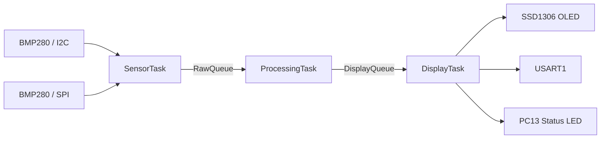
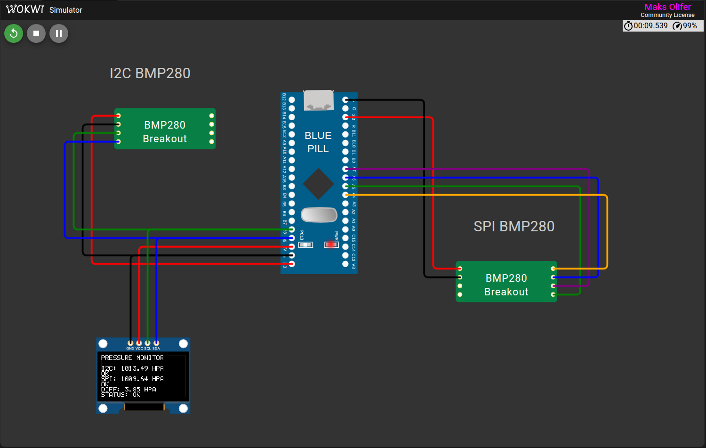

# Wokwi Pressure Monitor

Embedded system for **STM32F103C8T6 (Blue Pill)** built with **FreeRTOS / CMSIS-RTOS2**.

The project reads atmospheric pressure from two BMP280 sensors using two independent communication interfaces:

- BMP280 #1 — I2C
- BMP280 #2 — SPI
- SSD1306 128×64 OLED — I2C
- USART1 — diagnostic output
- PC13 — system status LED

The purpose of the project is to demonstrate an RTOS-based architecture where sensor acquisition, data processing, and output are separated into independent tasks.

---

## System Architecture

The application is organized as a pipeline of three FreeRTOS tasks:



The tasks communicate through **FreeRTOS message queues**.  
The I2C bus is protected by a **mutex**, because the I2C BMP280 and SSD1306 display share the same bus.

### SensorTask

`SensorTask` is responsible for acquiring measurements from both sensors.

Every **100 ms** it:

1. reads the first BMP280 through I2C;
2. reads the second BMP280 through SPI;
3. stores both measurements and their status information in `SensorRawData_t`;
4. sends the structure to `RawQueue`.

The task has priority `AboveNormal` and a 1024-byte stack.

### ProcessingTask

`ProcessingTask` waits for new measurements in `RawQueue`.

It performs all pressure-data validation and processing:

- communication and Chip ID validation;
- valid pressure range check;
- median filtering over 5 samples;
- pressure spike detection;
- stale-data detection;
- comparison between I2C and SPI measurements.

Valid pressure values must be within **30 000–120 000 Pa**.

A change greater than **2000 Pa** relative to the median is detected as a spike.

When both channels are valid, their difference is calculated.  
A difference greater than **1000 Pa** produces a `MISMATCH` warning.

The processed result is sent to `DisplayQueue`.

The task has priority `Normal` and a 1024-byte stack.

### DisplayTask

`DisplayTask` receives the newest processed result and updates the user interface every **500 ms**.

It is responsible for:

- rendering information on the SSD1306 OLED;
- UART diagnostic output;
- controlling the PC13 status LED;
- monitoring RTOS heap and task stack usage.

The OLED displays the pressure from both sensors, their current state, the difference between the measurements, and the overall system status.

The task has priority `BelowNormal` and a 2048-byte stack.

---

## FreeRTOS Objects

| Object | Size | Purpose |
|---|---:|---|
| `SensorTask` | 1024 B stack | Sensor acquisition |
| `ProcessingTask` | 1024 B stack | Data validation and processing |
| `DisplayTask` | 2048 B stack | OLED, UART and status output |
| `RawQueue` | 4 messages | SensorTask → ProcessingTask |
| `DisplayQueue` | 2 messages | ProcessingTask → DisplayTask |
| `i2cmutex` | — | Protects the shared I2C bus |

The RTOS tick frequency is **1000 Hz**, giving a 1 ms RTOS time base.

If one of the queues becomes full, the oldest message is removed before the newest one is inserted. This keeps the system working with the most recent sensor information instead of processing outdated data.

---

## Pressure Processing

Each sensor channel can have one of the following states:

| Status | Description |
|---|---|
| `WAIT` | Not enough samples have been collected yet |
| `OK` | Measurement is valid |
| `COMM` | Communication error |
| `ID` | Invalid BMP280 Chip ID |
| `RANGE` | Pressure is outside the allowed range |
| `SPIKE` | Sudden pressure change detected |
| `STALE` | Measurement is too old |

Five valid measurements are required before the median-filtered pressure is considered ready.

Warnings are retained for at least **2 seconds**, so short communication errors or pressure spikes remain visible to the user.

---

## Communication Interfaces

### I2C

The I2C bus is shared by:

- BMP280 at address `0x76`;
- SSD1306 OLED at address `0x3C`.

Because both devices use the same bus, access is synchronized using the FreeRTOS `i2cmutex`.

### SPI

The second BMP280 uses SPI in **Mode 0**, **MSB first**.

Its Chip ID is checked during initialization and must equal `0x58`.

Unlike I2C, SPI does not provide an ACK mechanism, so reading and validating the Chip ID is also used to confirm that the expected sensor is responding.

---

## Pin Configuration

### Wokwi Simulation

| STM32 Pin | Function | Connected Device |
|---|---|---|
| **PB8** | Software I2C SCL | BMP280 I2C + SSD1306 |
| **PB9** | Software I2C SDA | BMP280 I2C + SSD1306 |
| **PA4** | SPI CS | BMP280 SPI |
| **PA5** | SPI SCK | BMP280 SPI |
| **PA6** | SPI MISO | BMP280 SPI SDO |
| **PA7** | SPI MOSI | BMP280 SPI SDI |
| **PA9** | USART1 TX | Wokwi Serial Monitor RX |
| **PA10** | USART1 RX | Wokwi Serial Monitor TX |
| **PC13** | Status LED | System warning/error indication |

The BMP280 sensors are powered from **3.3 V**.

The SSD1306 module in the Wokwi diagram is connected to **5 V**.

All devices share a common **GND**.

The Wokwi I2C bus also contains explicit **4.7 kΩ pull-up resistors** on SDA and SCL.

### Physical STM32F103

When `WOKWI_SIMULATION=OFF`, the firmware uses the standard STM32 peripherals:

| STM32 Pin | Peripheral | Function |
|---|---|---|
| **PB6** | I2C1 SCL | Hardware I2C clock |
| **PB7** | I2C1 SDA | Hardware I2C data |
| **PA4** | GPIO | SPI Chip Select |
| **PA5** | SPI1 SCK | SPI clock |
| **PA6** | SPI1 MISO | SPI input |
| **PA7** | SPI1 MOSI | SPI output |
| **PA9** | USART1 TX | UART transmit |
| **PA10** | USART1 RX | UART receive |
| **PC13** | GPIO | Status LED |

---

## Wokwi-Specific Changes

The Wokwi version uses the same application logic, FreeRTOS kernel, tasks, queues, mutex, drivers, and data-processing code as the physical STM32 version.

Several low-level components are replaced only to work around limitations of the STM32F103 simulation.

### Custom FreeRTOS Port

The standard FreeRTOS Cortex-M3 port relies on Cortex-M exception mechanisms such as **SVC** and **PendSV** to start and switch tasks.

During development, these mechanisms did not behave as required in the Wokwi STM32F103 simulation.

Therefore, when:

```text
WOKWI_SIMULATION=ON
```

the standard:

```text
portable/GCC/ARM_CM3/port.c
```

is replaced by:

```text
portable/GCC/ARM_CM3_WOKWI/port.c
```

The **FreeRTOS kernel itself is not modified**.

The custom Wokwi portability layer:

- starts the first task directly in Thread mode using PSP;
- performs context switching without relying on PendSV;
- uses SysTick at 1000 Hz for the FreeRTOS time base;
- saves and restores task context at safe Thread-mode switching points;
- uses PRIMASK to protect critical sections.

When `WOKWI_SIMULATION=OFF`, the project returns to the standard FreeRTOS Cortex-M3 port.

### Software I2C

The physical version uses the STM32 **I2C1 peripheral** on PB6/PB7.

For the Wokwi simulation, I2C is implemented in software in:

```text
Core/Src/wokwi_i2c.c
```

The simulated bus uses:

```text
PB8 -> SCL
PB9 -> SDA
```

The software implementation generates START, STOP, ACK, repeated START and data transfers directly through GPIO.

It also supports bus recovery using nine SCL pulses.

This implementation exists only as a Wokwi compatibility layer and is not used in the physical STM32 build.

### Software SPI

The physical version uses the STM32 **SPI1 peripheral**.

In Wokwi, SPI signaling is generated directly through GPIO by:

```text
Core/Src/wokwi_spi.c
```

The pin configuration remains:

```text
PA4 -> CS
PA5 -> SCK
PA6 -> MISO
PA7 -> MOSI
```

The protocol remains SPI Mode 0, MSB first.

### Custom BMP280 Model

The Wokwi simulation uses a custom BMP280 model implemented in:

```text
chips/bmp280.chip.c
```

The model supports both I2C and SPI communication and allows the simulation to configure pressure, noise, and artificial pressure spikes.

For testing purposes, the custom model uses a simplified pressure representation:

```text
raw20 = pressure_pa << 3
```

Therefore, the simulated pressure encoding is **not the real Bosch BMP280 ADC and compensation algorithm**.

The custom chip is intended to test the embedded architecture, communication interfaces, RTOS synchronization, filtering, error handling, and display logic.

---

## OLED Output

The SSD1306 driver uses a **1024-byte framebuffer** for the 128×64 display.

The first frame updates the complete display. After that, the driver tracks which columns have changed and transfers only the modified parts of the framebuffer.

This reduces unnecessary I2C traffic.

The display shows:

```text
PRESSURE MONITOR

I2C: xxxx.xx HPA
OK

SPI: xxxx.xx HPA
OK

DIFF: xx.xx HPA
STATUS: OK
```

If a sensor fails, the corresponding pressure value is replaced by an error state instead of displaying an old measurement as if it were still valid.

---

## Project Structure

```text
WokwiSystem/
│
├── Core/
│   ├── Inc/
│   │   ├── app_config.h
│   │   ├── app_tasks.h
│   │   ├── app_types.h
│   │   ├── bmp280.h
│   │   ├── pressure_processing.h
│   │   ├── ssd1306.h
│   │   ├── wokwi_i2c.h
│   │   └── wokwi_spi.h
│   │
│   └── Src/
│       ├── main.c
│       ├── app_tasks.c
│       ├── pressure_processing.c
│       ├── bmp280.c
│       ├── ssd1306.c
│       ├── wokwi_i2c.c
│       └── wokwi_spi.c
│
├── Middlewares/
│   └── Third_Party/FreeRTOS/
│       └── Source/portable/GCC/
│           └── ARM_CM3_WOKWI/
│               └── port.c
│
├── chips/
│   └── bmp280.chip.c
│
├── docs/
│   └── wokwi-pressure-monitor.png
│
├── diagram.json
├── wokwi.toml
└── CMakeLists.txt
```

---

## Result

The final simulation contains two independent BMP280 pressure sensors connected to the STM32F103 using **I2C** and **SPI**.

`SensorTask` periodically acquires measurements, `ProcessingTask` validates and filters the data, and `DisplayTask` presents the final result on the SSD1306 OLED.

The screenshot below shows the complete Wokwi circuit and the resulting OLED output.

